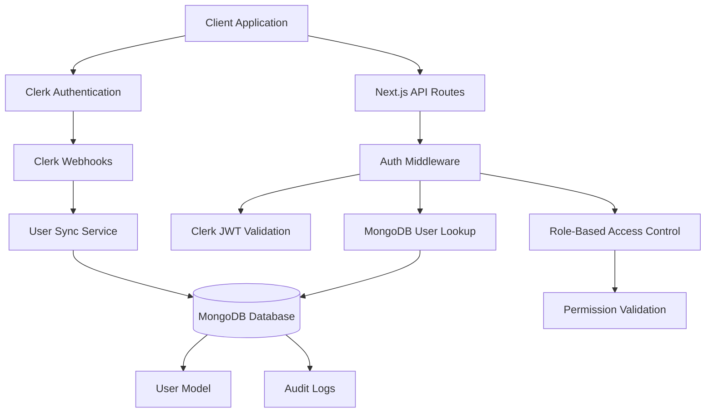

# Design Document: Clerk-MongoDB Integration

## Overview

This design outlines the integration of Clerk authentication with the existing MongoDB-based restaurant ERP system. The solution maintains seamless user experience while preserving role-based access control and database connectivity. The integration follows a hybrid approach where Clerk handles authentication and the MongoDB database maintains user profiles, roles, and business logic.

## Architecture

### High-Level Architecture



### Data Flow

1. **Authentication Flow**: User authenticates via Clerk → Clerk issues JWT → Client includes JWT in API requests
2. **Authorization Flow**: API middleware validates JWT → Fetches user from MongoDB → Checks role permissions → Grants/denies access
3. **Synchronization Flow**: Clerk webhook triggers → User sync service processes → Updates MongoDB user document

## Components and Interfaces

### 1. User Synchronization Service

**Purpose**: Maintains consistency between Clerk user data and MongoDB user documents.

**Location**: `lib/services/userSyncService.ts`

**Key Methods**:

- `syncUserFromClerk(clerkUserId: string)`: Syncs user data from Clerk to MongoDB
- `handleUserCreated(clerkUser: ClerkUser)`: Creates new MongoDB user document
- `handleUserUpdated(clerkUser: ClerkUser)`: Updates existing MongoDB user document
- `handleUserDeleted(clerkUserId: string)`: Handles user deletion cleanup

**Interface**:

```typescript
interface UserSyncService {
  syncUserFromClerk(clerkUserId: string): Promise<IUser>;
  handleUserCreated(clerkUser: ClerkUser): Promise<IUser>;
  handleUserUpdated(clerkUser: ClerkUser): Promise<IUser>;
  handleUserDeleted(clerkUserId: string): Promise<void>;
  retryFailedSync(clerkUserId: string): Promise<IUser>;
}
```

### 2. Enhanced User Model

**Purpose**: Extended MongoDB user model to include Clerk integration fields.

**Location**: `lib/models/User.ts` (enhanced)

**New Fields**:

- `clerkId`: Unique Clerk user identifier
- `lastSyncAt`: Timestamp of last synchronization
- `syncStatus`: Status of synchronization (synced, pending, failed)

**Enhanced Interface**:

```typescript
interface IUser {
  _id: string;
  clerkId: string; // NEW: Clerk user ID
  email: string;
  name: string;
  firstName?: string;
  lastName?: string;
  role: "admin" | "manager" | "user";
  emailVerified?: Date;
  image?: string;
  lastSyncAt?: Date; // NEW: Last sync timestamp
  syncStatus: "synced" | "pending" | "failed"; // NEW: Sync status
  createdAt: Date;
  updatedAt: Date;
}
```

### 3. Authentication Middleware

**Purpose**: Validates Clerk JWT tokens and injects user context into API requests.

**Location**: `lib/middleware/clerkAuth.ts`

**Key Functions**:

- `withClerkAuth()`: Higher-order function for API route protection
- `validateClerkToken()`: Validates and decodes Clerk JWT
- `getUserContext()`: Fetches complete user context from MongoDB

**Interface**:

```typescript
interface AuthMiddleware {
  withClerkAuth<T>(
    handler: (req: NextRequest, context: UserContext) => Promise<T>,
    requiredPermissions?: string[]
  ): (req: NextRequest) => Promise<NextResponse>;

  validateClerkToken(token: string): Promise<ClerkUser>;
  getUserContext(clerkUserId: string): Promise<UserContext>;
}

interface UserContext {
  clerkUser: ClerkUser;
  mongoUser: IUser;
  permissions: string[];
}
```

### 4. Webhook Handler

**Purpose**: Processes Clerk webhook events for user synchronization.

**Location**: `app/api/webhooks/clerk/route.ts`

**Supported Events**:

- `user.created`: New user registration
- `user.updated`: User profile updates
- `user.deleted`: User account deletion

### 5. Role-Based Access Control (RBAC) Service

**Purpose**: Manages role-based permissions using MongoDB user roles.

**Location**: `lib/services/rbacService.ts`

**Key Methods**:

- `checkPermission(userId: string, permission: string)`: Validates user permission
- `getUserPermissions(role: string)`: Gets permissions for role
- `updateUserRole(userId: string, newRole: string)`: Updates user role

## Data Models

### Enhanced User Schema

```typescript
const userSchema = new mongoose.Schema<IUser>(
  {
    clerkId: {
      type: String,
      required: true,
      unique: true,
      index: true,
    },
    email: {
      type: String,
      required: true,
      unique: true,
      lowercase: true,
      trim: true,
    },
    name: {
      type: String,
      required: true,
      trim: true,
    },
    firstName: {
      type: String,
      trim: true,
    },
    lastName: {
      type: String,
      trim: true,
    },
    role: {
      type: String,
      enum: ["admin", "manager", "user"],
      default: "user",
    },
    emailVerified: {
      type: Date,
    },
    image: {
      type: String,
    },
    lastSyncAt: {
      type: Date,
      default: Date.now,
    },
    syncStatus: {
      type: String,
      enum: ["synced", "pending", "failed"],
      default: "pending",
    },
  },
  {
    timestamps: true,
  }
);
```

### Permission Matrix

```typescript
const ROLE_PERMISSIONS = {
  admin: [
    "users.read",
    "users.create",
    "users.update",
    "users.delete",
    "products.read",
    "products.create",
    "products.update",
    "products.delete",
    "inventory.read",
    "inventory.update",
    "costs.read",
    "costs.update",
    "sales.read",
    "sales.create",
    "audit.read",
    "system.manage",
  ],
  manager: [
    "users.read",
    "products.read",
    "products.create",
    "products.update",
    "inventory.read",
    "inventory.update",
    "costs.read",
    "costs.update",
    "sales.read",
    "sales.create",
    "audit.read",
  ],
  user: ["products.read", "inventory.read", "sales.read", "sales.create"],
};
```

## Error Handling

### Synchronization Error Handling

1. **Retry Logic**: Exponential backoff for failed synchronizations
2. **Error Logging**: Comprehensive logging of sync failures
3. **Fallback Behavior**: Graceful degradation when sync fails
4. **Manual Sync**: Admin interface for manual user synchronization

### Authentication Error Handling

1. **Token Validation Errors**: Clear error messages for invalid/expired tokens
2. **Permission Denied**: Appropriate HTTP status codes and error responses
3. **Database Connection Issues**: Fallback authentication mechanisms
4. **Webhook Processing Errors**: Dead letter queue for failed webhook events

### Error Response Format

```typescript
interface ErrorResponse {
  success: false;
  error: {
    code: string;
    message: string;
    details?: any;
    timestamp: string;
  };
}
```

## Testing Strategy

### Unit Tests

1. **User Sync Service Tests**:

   - Test user creation from Clerk data
   - Test user update synchronization
   - Test error handling and retry logic

2. **Authentication Middleware Tests**:

   - Test JWT validation
   - Test permission checking
   - Test error scenarios

3. **RBAC Service Tests**:
   - Test permission validation
   - Test role-based access control
   - Test role updates

### Integration Tests

1. **Clerk Webhook Integration**:

   - Test webhook event processing
   - Test user synchronization flow
   - Test error handling

2. **API Route Protection**:

   - Test authenticated API access
   - Test role-based API restrictions
   - Test unauthorized access handling

3. **Database Integration**:
   - Test user model operations
   - Test data consistency
   - Test concurrent access scenarios

### End-to-End Tests

1. **Authentication Flow**:

   - Test complete sign-in process
   - Test role-based dashboard access
   - Test user profile synchronization

2. **User Management**:
   - Test admin user management
   - Test role updates
   - Test user deletion handling

## Security Considerations

### Token Security

1. **JWT Validation**: Strict validation of Clerk JWT tokens
2. **Token Expiration**: Proper handling of expired tokens
3. **Secure Headers**: Implementation of security headers

### Data Protection

1. **Sensitive Data**: No storage of passwords in MongoDB
2. **Data Encryption**: Encryption of sensitive user data
3. **Audit Logging**: Comprehensive audit trail for user operations

### Access Control

1. **Principle of Least Privilege**: Minimal required permissions
2. **Role Validation**: Server-side role validation
3. **API Security**: Rate limiting and input validation

## Performance Optimizations

### Database Optimization

1. **Indexing**: Proper indexes on clerkId, email, and role fields
2. **Connection Pooling**: Optimized MongoDB connection pool
3. **Query Optimization**: Efficient user lookup queries

### Caching Strategy

1. **User Context Caching**: Cache user permissions and role data
2. **JWT Validation Caching**: Cache valid JWT tokens temporarily
3. **Permission Caching**: Cache role-permission mappings

### Synchronization Optimization

1. **Batch Processing**: Batch webhook event processing
2. **Debouncing**: Debounce rapid user updates
3. **Background Processing**: Asynchronous sync operations

## Migration Strategy

### Phase 1: Setup and Configuration

- Install and configure Clerk
- Set up webhook endpoints
- Create user sync service

### Phase 2: User Model Enhancement

- Add Clerk fields to User model
- Create migration script for existing users
- Update user-related API routes

### Phase 3: Authentication Integration

- Implement authentication middleware
- Update API route protection
- Test authentication flow

### Phase 4: User Management Updates

- Update admin user management interface
- Implement role management with Clerk integration
- Test complete user lifecycle

### Phase 5: Testing and Deployment

- Comprehensive testing
- Performance optimization
- Production deployment
